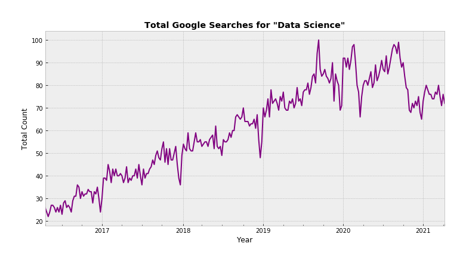

# Tracking Keyword Trends on Google Search with Pytrends

The `pytrends` repository can be found [here](https://github.com/GeneralMills/pytrends).

## Blog Post

Check out my blog post about `pytrends` on Towards Data Science [here](https://towardsdatascience.com/jupyter-notebook-not-rendering-on-github-heres-a-simple-solution-e51aa6ca29b6?sk=bad177d6b37fcbd0cae5ab39a1cf4094).

## Installation
```
pip install pytrends
```

## Interest Over Time



## For More Information

- For additional information or suggestions, contact Sidney Kung at [sidneyjkung@gmail.com](mailto:sidneyjkung@gmail.com)

**Let's connect!**

<a href="https://www.linkedin.com/in/sidneykung/" target="_blank"></a> <a href="https://twitter.com/sidney_k98" target="_blank"></a>
